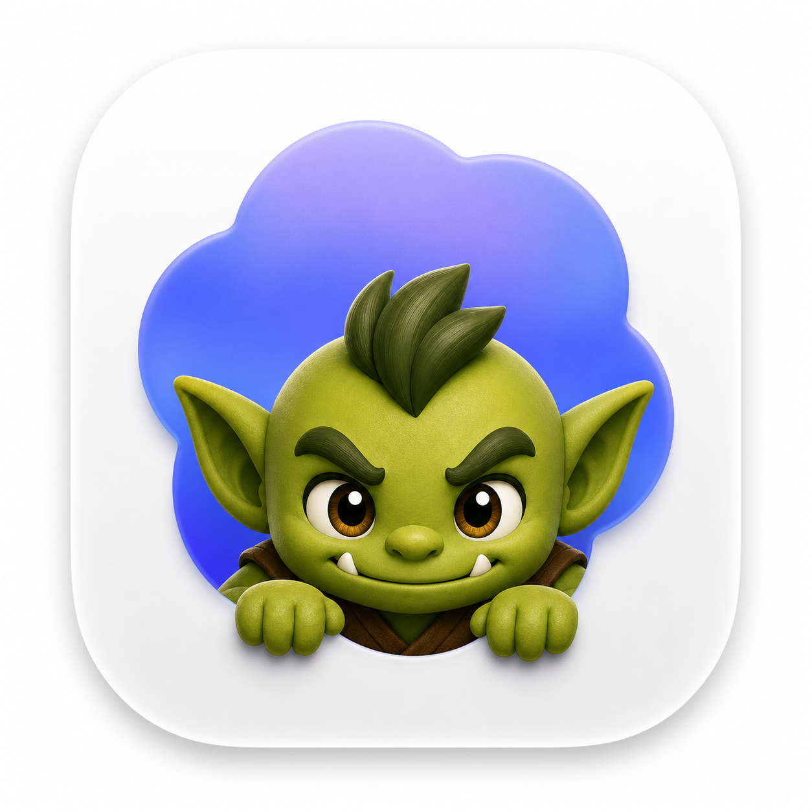
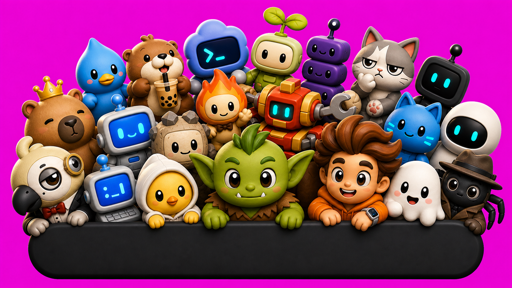

# CodexPetBar

<p align="center">
  
</p>

<p align="center">
  An Apple-Silicon macOS menu bar companion for Codex pets.
</p>



CodexPetBar puts an animated pet in your macOS menu bar. It can follow the pet selected in Codex, switch animations from local Codex activity, and load custom pets from `~/.codex/pets`.

[Website](https://andytyler.github.io/codex-pet-bar/) · [Download the latest release](https://github.com/andytyler/codex-pet-bar/releases/latest)

**Release status:** this branch contains v0.2.0, pending Apple notarization. Public downloads and Homebrew currently provide v0.1.2. The features documented below describe v0.2.0; build from source to try them now.

## Install

### Download

Download the latest release zip, unzip it, move **CodexPetBar.app** to **Applications**, then open it. Starting with v0.2.0, Pet Bar asks whether to open automatically when you log in.

### Homebrew

```bash
brew install --cask andytyler/tap/codex-pet-bar
codex-pet-bar
```

### From a Fresh Clone

```bash
git clone https://github.com/andytyler/codex-pet-bar.git
cd codex-pet-bar
./script/install.sh --open
```

Source installs require an Apple-Silicon Mac, macOS 14+, and Swift 6.2 or later (Xcode 26+). The installer builds the app, copies it to `~/Applications/CodexPetBar.app`, creates the configured pet directory, and opens it. Downloaded releases do not require Xcode.

To install the optional Codex activity hooks during the same fresh-clone install:

```bash
./script/install.sh --with-hooks --open
```

To connect Codex, Claude Code, and Cursor in one step:

```bash
./script/install.sh --with-all-hooks --open
```

You can also connect every supported agent after launch from **Integrations → Install All** in the pet menu. Hooks are optional, but they enable richer reactions for prompts, tool runs, permission requests where supported, failures, and stops. Codex may ask you to approve newly installed hooks before reactions begin.

For a development-only run without copying the app into `~/Applications`:

```bash
./script/build_and_run.sh
```

## Use

CodexPetBar has no Dock icon. Up to 32 active local tasks get their own provider flag beside the pet: Codex, orange Claude, or Cursor. Waiting and failure attention stays attached to the task that needs it, including when several providers are active together. To keep the menu bar bounded under pathological loads, more than 32 simultaneous scopes become 30 attention-prioritized flags plus a compact `+N` marker; every retained task remains available in the task list. Hover the pet for dense, project-grouped task summaries, or click it for Tasks, Pets, Appearance, Integrations, Utilities, and Quit.

On first launch from Applications, Pet Bar asks whether to **Open at Login**. Choose **Not Now** to leave it off. You can change the setting later from the pet menu. macOS may require approval in System Settings → General → Login Items.

## Optional Local Agent Activity

CodexPetBar can infer top-level local Codex activity without hooks. Install hooks for complete local lifecycle events from the Codex app/CLI/IDE extension, Claude Code, or Cursor, including concurrent sessions and provider-reported subagents. The existing no-argument command remains Codex-only:

With the packaged command:

```bash
codex-pet-bar --add-codex-hooks
```

From a source checkout:

```bash
./script/install_hooks.py
```

Install every supported provider, or one provider explicitly:

```bash
codex-pet-install-hooks --provider all
codex-pet-install-hooks --provider claude
codex-pet-install-hooks --provider cursor
```

Claude Code hooks are merged into `~/.claude/settings.json`, and native Cursor hooks into `~/.cursor/hooks.json`; existing settings and foreign hooks are preserved. Cursor does not expose a native permission-request hook, so CodexPetBar does not claim a Cursor approval state.

All providers append to the same locked, rotating `~/.codex/pet-events.jsonl`. The hook never stores user prompt text. It stores only prompt length and, when a provider explicitly includes its final assistant output in a terminal hook, a whitespace-normalized summary capped at 280 characters.

This integration is intentionally local. Codex Cloud, Cursor Cloud, remote-machine agents, and agents launched on another computer execute outside this Mac and cannot write its local event log. Supporting those surfaces requires an authenticated cloud sync or webhook service; CodexPetBar does not silently claim them as captured.

## Custom Pets

A pet package is a folder with:

```text
pet.json
spritesheet.webp
```

Install one with:

```bash
codex-pet-install-pet /path/to/pet
```

From a source checkout:

```bash
./script/install_pet.sh /path/to/pet
```

Then choose **Refresh Pets** from the CodexPetBar menu. Pet packages are installed into `$CODEX_HOME/pets/<pet-id>`, or `~/.codex/pets/<pet-id>` when `CODEX_HOME` is unset. See [docs/custom-pets.md](docs/custom-pets.md) for the spritesheet format.

## Uninstall

Homebrew:

```bash
brew uninstall --cask codex-pet-bar
```

Source install:

```bash
./script/uninstall.sh
```

Uninstall removes the app and CodexPetBar's own global hook entries from Codex, Claude Code, and Cursor while preserving unrelated settings and hooks.
Pets and workspace-local hooks are left in place so you can reuse them:

```text
~/.codex/pets
<workspace>/.codex/hooks.json
<workspace>/.codex/hooks/codex_pet_event.py
```

To remove Codex global hooks without uninstalling the app, run `codex-pet-install-hooks --remove-global`. Remove all provider hooks with `codex-pet-install-hooks --provider all --remove-global`.
To remove workspace-local hooks, run `codex-pet-install-hooks --remove-workspace /path/to/workspace`.

## Privacy

CodexPetBar is local-first. It reads local Codex files for installed pets, selected-pet sync, and activity timing. It writes app preferences, installed pets, and optional hook event metadata only when those features are used.

## Troubleshooting

- **No pet appears**: install a pet into `~/.codex/pets/<pet-id>` and choose **Refresh Pets**.
- **Pet does not match Codex**: enable **Follow Codex Pet** and install a pet whose `pet.json` `id` matches the selected Codex pet.
- **Activity does not change**: install hooks, approve them in the Codex app, then confirm Codex is appending events to `~/.codex/pet-events.jsonl`.
- **macOS blocks the app**: use a signed release, or build locally from source.
