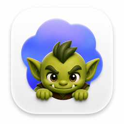
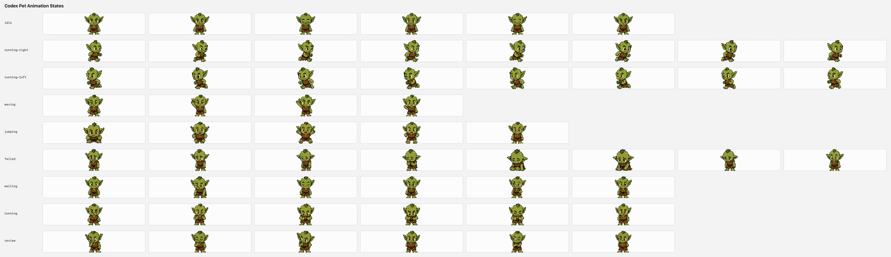

# Quick Start



CodexPetBar is a macOS menu bar companion for Codex pets. It shows an animated pet in the menu bar, follows the custom pet selected by Codex when possible, and uses local Codex files to choose automatic activity states.

Requirements:

- macOS 14 Sonoma or newer
- Xcode Command Line Tools with Swift 6 support when building from source
- A full Xcode/Swift toolchain for reliable Swift Testing execution
- Codex, if you want selected-pet sync or activity-driven states

From a source checkout:

```bash
swift test
./script/install.sh --open
```

That builds an optimized app bundle, installs it to `~/Applications/CodexPetBar.app`, creates `~/.codex/pets` if needed, and opens the app.

Install the optional Codex activity hook if you want CodexPetBar event logs for prompts, tool use, permission requests, failures, and stops:

```bash
./script/install_hooks.py
```

Or, after installing the packaged command-line wrapper:

```bash
codex-pet-bar --add-codex-hooks
```

Open the menu bar pet to select pets, toggle **Follow Codex Pet**, change size, force an animation state, refresh pets, or open the pets folder.



## What It Does

CodexPetBar runs as an accessory app with no Dock icon. Its menu bar item renders frames from the selected pet spritesheet and keeps the app controls in the pet menu.

The app discovers pet packages in:

```text
~/.codex/pets/<pet-id>/
```

By default it tries to follow Codex's selected custom pet by reading `~/.codex/.codex-global-state.json`. If that pet is not installed locally, or if **Follow Codex Pet** is off, CodexPetBar uses your manual menu selection.

Automatic activity states are local file signals:

- `waiting`: no recent Codex activity detected
- `running`: Codex global state changed recently
- `review`: Codex activity was recent but is no longer fresh; local transcription growth also maps here as the current listening-style signal
- `failed`: available as a manual animation state and pet atlas state

The optional hook writes local Codex lifecycle events for prompts, tool use, permission requests, failures, and stops. Hook installation is explicit; installing the app or cask does not mutate Codex config automatically.

## Install

### Homebrew Cask

This repo includes a cask at [Casks/codex-pet-bar.rb](Casks/codex-pet-bar.rb), but do not assume it is published until the tap has been updated with a release asset and SHA.

Once published to `andytyler/tap`, users can install with:

```bash
brew tap andytyler/tap
brew install --cask codex-pet-bar
codex-pet-bar
```

Equivalent one-command install after publication:

```bash
brew install --cask andytyler/tap/codex-pet-bar
codex-pet-bar
```

To test the cask locally from this checkout before tap publication:

```bash
brew install --cask ./Casks/codex-pet-bar.rb
codex-pet-bar
```

Packaged helper commands:

```bash
codex-pet-bar
codex-pet-bar --add-codex-hooks
codex-pet-install-hooks
codex-pet-install-hooks --workspace /path/to/workspace
codex-pet-install-pet /path/to/pet
codex-pet-validate-pet /path/to/pet
```

See [docs/homebrew-tap.md](docs/homebrew-tap.md) for the tap workflow.

### GitHub Release Or Direct Download

For direct distribution, attach the packaged zip from `script/package_app.sh` to a GitHub release:

```bash
VERSION=0.1.0 ./script/package_app.sh --configuration release --zip --output /private/tmp/codexpet-release
```

The zip name is:

```text
CodexPetBar-0.1.0-macos.zip
```

Release downloads should live at:

```text
https://github.com/andytyler/codex-pet-bar/releases
```

Developer ID signing and notarization are recommended for public direct downloads so Gatekeeper accepts the app cleanly.

### Source Install

The convenience installer is:

```bash
./script/install.sh --open
```

Core commands behind that flow are:

```bash
swift test
./script/package_app.sh --configuration release --output /private/tmp/codexpet-install
mkdir -p ~/Applications
ditto /private/tmp/codexpet-install/CodexPetBar.app ~/Applications/CodexPetBar.app
open ~/Applications/CodexPetBar.app
```

Use the script for normal installs because it handles cleanup and app bundle layout, but the underlying steps are ordinary SwiftPM build, package, copy, and open operations.

## Uninstall

Homebrew:

```bash
brew uninstall --cask codex-pet-bar
```

Source install:

```bash
./script/uninstall.sh
```

Manual app removal:

```bash
rm -rf ~/Applications/CodexPetBar.app
```

Uninstall leaves pets and hook files in place. Remove these only if you no longer want CodexPetBar integration:

```text
~/.codex/pets
~/.codex/hooks.json
~/.codex/hooks/codex_pet_event.py
~/.codex/pet-events.jsonl
```

If you have workspace-local hooks, also check:

```text
<workspace>/.codex/hooks.json
<workspace>/.codex/hooks/codex_pet_event.py
```

## Custom Pets

A pet package is a directory with a manifest and a spritesheet:

```text
my-pet/
  pet.json
  spritesheet.webp
```

Minimal manifest:

```json
{
  "id": "my-pet",
  "displayName": "My Pet",
  "description": "A short description.",
  "spritesheetPath": "spritesheet.webp"
}
```

Spritesheets must be exactly `1536x1872` pixels: 8 columns by 9 rows, with `192x208` pixel cells.

Validate and install:

```bash
./script/validate_pet.py /path/to/my-pet
./script/install_pet.sh /path/to/my-pet
```

With the packaged commands:

```bash
codex-pet-validate-pet /path/to/my-pet
codex-pet-install-pet /path/to/my-pet
```

Then choose **Refresh Pets** from the CodexPetBar menu. Full atlas details are in [docs/custom-pets.md](docs/custom-pets.md).

## Privacy

CodexPetBar is local-first and does not include personal telemetry.

What it reads locally:

- `~/.codex/pets` for installed pet packages
- `~/.codex/.codex-global-state.json` for Codex's selected pet and recent activity timing
- `~/.codex/transcription-history.jsonl` size changes for a listening-style activity signal

What it writes locally:

- macOS preferences under the app bundle identifier
- `~/.codex/pets` when you install pets
- `~/.codex/hooks.json`, `~/.codex/hooks/codex_pet_event.py`, and `~/.codex/pet-events.jsonl` only when hooks are installed

The hook records event metadata such as event type, timestamp, workspace path, session or turn IDs when provided, tool name, permission mode, model, and prompt length. It does not write prompt text.

## Troubleshooting

- **No pets found**: install a pet into `~/.codex/pets/<pet-id>` and choose **Refresh Pets**.
- **Fallback paw icon**: the selected pet failed to load. Run `./script/validate_pet.py /path/to/pet` and confirm the manifest points at a `1536x1872` spritesheet.
- **Pet does not match Codex**: keep **Follow Codex Pet** enabled and install a pet whose `pet.json` `id` matches Codex's selected custom pet ID.
- **Activity does not change**: current automatic states depend on `~/.codex/.codex-global-state.json` modification time and `~/.codex/transcription-history.jsonl` growth. Run Codex, then check that those files are changing locally.
- **Hook events are not appearing**: install hooks with `codex-pet-bar --add-codex-hooks`, then review or trust the hook in Codex with `/hooks` if prompted.
- **`swift test` cannot import `Testing`, or builds without running tests**: select a full Xcode install with `sudo xcode-select -s /Applications/Xcode.app/Contents/Developer`. A Command Line Tools-only Swift 6.3.2 install may expose `Testing.framework` without giving SwiftPM enough runtime wiring to execute Swift Testing tests.
- **Downloaded app is blocked by macOS**: publish a Developer ID signed and notarized build, or build locally from source.
- **Code-sign verification fails in a cloud-backed checkout**: package outside the cloud folder, for example `./script/package_app.sh --zip --output /private/tmp/codexpet-dist`.

## Development

Run tests:

```bash
swift test
python3 -m unittest discover -s Tests/InstallHooksTests -p 'test_*.py'
python3 -m unittest discover -s Tests/HomebrewReleaseTests -p 'test_*.py'
```

If the active developer directory is Command Line Tools only, verify it before trusting the result:

```bash
xcode-select -p
swift test list
```

The test list should show CodexPetBarCore test cases. If it only builds and prints no tests, switch to a full Xcode toolchain before treating the suite as passing.

Build:

```bash
swift build
swift build -c release
```

Run the executable directly:

```bash
swift run CodexPetBar
```

Build and run a debug app bundle:

```bash
./script/build_and_run.sh
```

Package a release app bundle and zip:

```bash
VERSION=0.1.0 ./script/package_app.sh --configuration release --zip --output /private/tmp/codexpet-release
```

Validate a packaged app:

```bash
codesign --verify --deep --strict /private/tmp/codexpet-release/CodexPetBar.app
spctl --assess --type execute --verbose=4 /private/tmp/codexpet-release/CodexPetBar.app
```

Release workflow references:

- [Homebrew tap and cask workflow](docs/homebrew-tap.md)
- [Custom pet package format](docs/custom-pets.md)
